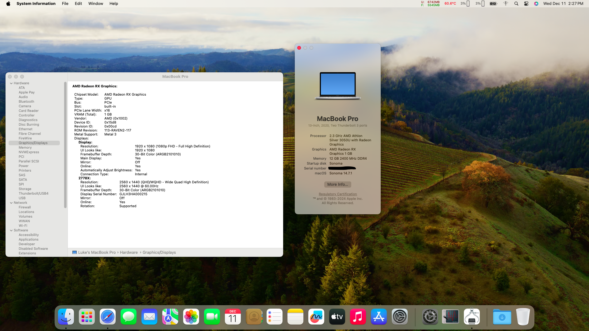

# Acer-A314-22-Opencore

## Why?
I've always wanted to try to get a working AMD Hackintosh, and this machine is very cheap and has a modern enough CPU so I decided to finally try and get an all AMD machine working.

It works VERY well on Mac OS, and even for a weak CPU, I'd say it feels much snappier and better on Mac OS compared to Windows.

## Overview

This EFI has been tested and is perfect on Mac OS 13 `Ventura` and Mac OS 14 `Sonoma` currently <strong> NOT WORKING </strong> on Mac OS 15 `Sequoia` (WIP).

This machine is <s>VERY difficult</s> fairly easy to get running with the supplied EFI, Just make sure to follow my exact instructions under Usage.

<s>Only faults so far, is no working wifi Also the laptop won't boot the full install with the charger plugged in, try unplug the charger if you experiance a kernel panic during boot. </s> THIS WAS CAUSED BY A FAULTY NVME SSD

<s> No keyboard or touchpad working yet. </s>

## Specs

| Part             | Description                                                                                                    |
| ---------------- | -------------------------------------------------------------------------------------------------------------- |
| CPU              | 2.3 GHz AMD Athlon Silver 3050U with Radeon Graphics                                                           |
| iGPU             | AMD Radeon Graphics                                                                                            |
| Memory           | 12Gb (1 x 4Gb 2400MHz soldered and 1x8GB DDR4 Sodimm)                                                          |
| Storage          | <s>Intel 600P 128gb</s> Toshiba 512GB NVMe & 256GB Sata SSD (SATA fixed)                                       |
| Display          | 13 inch 1920x1080 IPS Matte Panel                                                                              |
| Wifi & Bluetooth | Intel® Dual-Band Wireless-AC 8265                                                                              |
| LAN              | Realtek RTL8168H/8111H                                                                                         |
| Audio            | Realtek ALC255                                                                                                        |
| External ports   | 2 x USB 3.0, 1 x Ethernet, 1 x USB 2.0, 1 x HDMI 1.4, 1 x 3.5 headphone/microphone combo,                      |

### Working and Not Working

|                                                   | Status | Note                              |
| ------------------------------------------------- | ------ | ----------------------------------|
| Keyboard                                          | ✅     |                                   |
| Touchpad                                          | ✅     |With all gestures                  |
| Ethernet                                          | ✅     |                                   |
| Wifi                                              | ✅     |Working perfectly with Airportitlwm|
| Bluetooth                                         | ✅     |                                   |
| Camera & Mic                                      | ✅     |                                   |
| Speaker & 3.5mm audio port                        | ✅     |                                   |
| iGPU & HDMI                                       | ✅     |Working perfectly with NootedRed   |
| USB                                               | ✅     |                                   |
| Sleep                                             | ✅     |                                   |
| Handoff                                           | ✅     |                                   |
| Airdrop                                           | ❌     |                                   |

## Usage

Download my EFI, Change your Serial with [GenSMBIOS](https://github.com/corpnewt/GenSMBIOS) 

MORE TO COME SOON.

