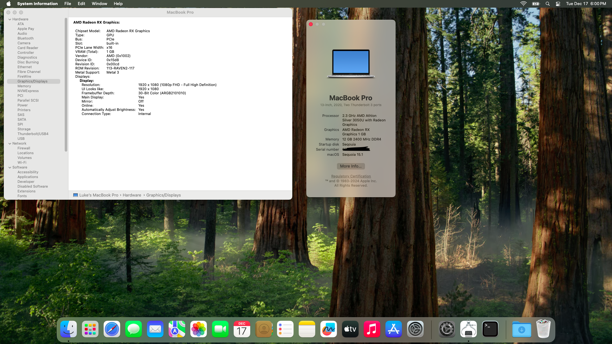

# Acer-A314-22-Opencore

## Why?
I've always wanted to try to get a working AMD Hackintosh, and this machine is very cheap and has a modern enough CPU so I decided to finally try and get an all AMD machine working.

It works VERY well on Mac OS, and even for a weak CPU, I'd say it feels much snappier and better on Mac OS compared to Windows.

## Overview

This EFI has been tested and is perfect on Mac OS 13 `Ventura` Mac OS 14 `Sonoma` and Mac OS 15 `Sequoia`.

This machine is <s>VERY difficult</s> fairly easy to get running with the supplied EFI, Just make sure to follow my exact instructions under Usage.

If you have any problems installing, make sure that your SSD is compatible with Mac OS and also <strong>Disable</strong> NootedRed during install on Sequoia.

## Specs

| Part             | Description                                                                                                    |
| ---------------- | -------------------------------------------------------------------------------------------------------------- |
| CPU              | 2.3 GHz AMD Athlon Silver 3050U with Radeon Graphics                                                           |
| iGPU             | AMD Radeon Graphics                                                                                            |
| Memory           | 12Gb (1 x 4Gb 2400MHz soldered and 1x8GB DDR4 Sodimm)                                                          |
| Storage          | <s>Intel 600P 128gb</s> Toshiba 512GB NVMe & 256GB Sata SSD (SATA fixed)                                       |
| Display          | 13 inch 1920x1080 IPS Matte Panel                                                                              |
| Wifi & Bluetooth | Intel® Dual-Band Wireless-AC 8265                                                                              |
| LAN              | Realtek RTL8168H/8111H                                                                                         |
| Audio            | Realtek ALC255                                                                                                        |
| External ports   | 2 x USB 3.0, 1 x Ethernet, 1 x USB 2.0, 1 x HDMI 1.4, 1 x 3.5 headphone/microphone combo,                      |

### Working and Not Working

|                                                   | Status | Note                              |
| ------------------------------------------------- | ------ | ----------------------------------|
| Keyboard                                          | ✅     |                                   |
| Touchpad                                          | ✅     |With all gestures                  |
| Ethernet                                          | ✅     |                                   |
| Wifi                                              | ✅     |Intel only with [Heliport](https://github.com/OpenIntelWireless/HeliPort) on Sequoia |
| Bluetooth                                         | ✅     |                                   |
| Camera & Mic                                      | ✅     |                                   |
| Speaker & 3.5mm audio port                        | ✅     |                                   |
| iGPU & HDMI                                       | ✅     |Working perfectly with NootedRed   |
| USB                                               | ✅     |                                   |
| Sleep                                             | ✅     |                                   |
| Handoff                                           | ✅     |                                   |
| Airdrop                                           | ❌     |                                   |

## Usage

1. Download my EFI, Change your Serial with [GenSMBIOS](https://github.com/corpnewt/GenSMBIOS) 

2. Go into the bios and make sure to disable `AMD-SVM` and `AMD-IOMMU` and `Secure Boot`

3. This EFI relies on the use of NootedRed which is a kext that allows the intergrated AMD grphics to work.
For this to work properely though your computer has to have at least 512MB of VRAM manually set (I'm using 1GB) and this is not possible to do on the factory Acer BIOS.
To do this you need to download [SmokelessUMAF](https://github.com/DavidS95/Smokeless_UMAF) 

4. After downloading copy all files onto a FAT32 formatted USB. 

5. Once you've done that press F12 and boot from it.

6. You should get a grey screen with a menu, use the arrow keys and select `Device Manager` then select `AMD CBS` then `NBIO Common Options` then `GFX Configuration`

7. Next youll need to select `UMA Mode` and change it to `UMA_SPECIFIED`

8. Then go down and select `UMA Frame buffer Size` and change it to `1G`

9. Now you should be okay to hit escape and save your changes and then reboot, your then ready to use the EFI

10. If installing Sequoia you MAY need to disable NootedRed during Install and then re-enable after install is complete.

